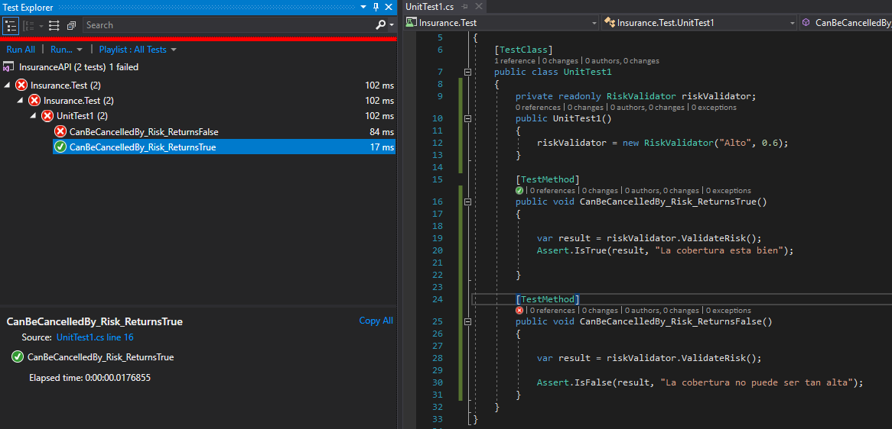

<h1>GAPInsurance</h1>

<h2>Login</h2>
Para la autenticacion y autorizacion se utilizo Auth0, se ingresa con una cuenta de google

<h2>CRUD</h2>
Se creo el maestro para administrar las polizas y uno para vincular las polizas al usuario

<h2>Pruebas</h2>
Se creo un proyecto de prueba unitarias y se ejecuto correctamente

